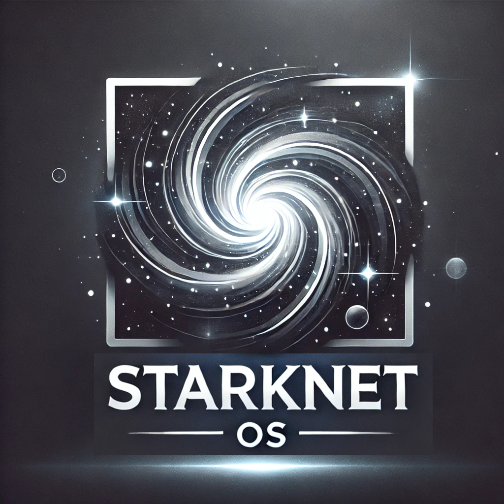

<div align="center">
  
  
  ### ✨ SNOS ✨
  
  A Rust Library for running the [Starknet OS](https://github.com/starkware-libs/cairo-lang/blob/master/src/starkware/starknet/core/os/os.cairo).

  [Report Bug](https://github.com/keep-starknet-strange/snos/issues/new?assignees=&labels=bug&projects=&template=bug_report.md&title=bug%3A+) · [Request Feature](https://github.com/keep-starknet-strange/snos/issues/new?labels=enhancement&title=feat%3A+)

  [](https://github.com/keep-starknet-strange/snos/actions/workflows/check.yml)
[](/LICENSE)
[![pr-welcome]](#-contributing)

[pr-welcome]: https://img.shields.io/static/v1?color=blue&label=PRs&style=flat&message=welcome

</div>

## Table of Contents
- [Table of Contents](#table-of-contents)
- [📖 About](#-about)
- [🛠️ Getting Started](#️-getting-started)
  - [Prerequisites](#prerequisites)
  - [Installation](#installation)
- [🧪 Running Tests](#-running-tests)
  - [Run Tests](#run-tests)
  - [Reset Tests](#reset-tests)
- [🚀 Usage](#-usage)
  - [Adding SNOS as a Dependency](#adding-snos-as-a-dependency)
  - [Using the **prove_block** Binary](#using-the-prove_block-binary)
- [🤝 Related Projects](#-related-projects)
- [📚 Documentation](#-documentation)
- [📜 License](#-license)


## 📖 About

[Starknet OS](https://github.com/starkware-libs/cairo-lang/blob/master/src/starkware/starknet/core/os/os.cairo) is a [Cairo](https://www.cairo-lang.org/) program designed to prove the integrity of state transitions between blocks on Starknet.

By re-executing transactions from a block and verifying consistency, it produces a [PIE](https://github.com/starkware-libs/cairo-lang/blob/a86e92bfde9c171c0856d7b46580c66e004922f3/src/starkware/cairo/lang/vm/cairo_pie.py#L219-L225) (Program Independent Execution) result. This PIE can be used to generate a STARK proof of integrity, which, if accepted by Starknet L1 verifiers, confirms block validity and updates the Starknet state root in the [StarknetCore contract](https://etherscan.io/address/0xc662c410c0ecf747543f5ba90660f6abebd9c8c4#code).

## 🛠️ Getting Started

### Prerequisites

Ensure you have the following dependencies installed:
- [Rust 1.76.0 or newer](https://www.rust-lang.org/tools/install)

#### Optional
- [pyenv](https://github.com/pyenv/pyenv-installer?tab=readme-ov-file#install) (recommended for managing Python versions and setting up environment)

- [rclone](https://rclone.org/install/) (recommended for downloading Pathfinder's database and being able to quickly use [`prove_block`](#using-the-prove_block-binary) binary)

### Installation

1. **Clone the Repository**

Clone this repository and its submodules:
   ```bash
   git clone https://github.com/keep-starknet-strange/snos.git --recursive
  ``` 

#### Install project dependencies
In order to compile the Starknet OS Cairo program, you’ll need the Cairo compiler:

- Follow the [Cairo documentation](https://docs.cairo-lang.org/quickstart.html)
- Or simply run:
```bash
./setup-scripts/setup-cairo.sh
```

This will create a virtual environment and download needed dependencies to compile cairo programs. You will need to activate it to compile Cairo programs.

## 🧪 Running Tests
To verify your setup, follow these steps:

### Activate snos-env:
```bash
 source ./snos-env/bin/activate
 ```

### Run Tests

```bash
./scripts/setup-tests.sh

cargo test
```

### Reset Tests

If you need to reset the test environment:

```bash
./scripts/reset-tests.sh
```

##  🚀 Usage 
### Adding SNOS as a dependency

You can add the following to your rust project's `Cargo.toml`:

```toml
starknet-os = { git = "https://github.com/keep-starknet-strange/snos", rev = "662d1706f5855044e52ebf688a18dd80016c8700" }
```

### Using the `prove_block` Binary

To execute correctly, SNOS requires detailed block information, including:

- **State changes**: Information about new classes, contracts, and any modifications to contract storage. (See [StateDiff](https://github.com/xJonathanLEI/starknet-rs/blob/5c676a64031901b5a203168fd8ef8d6b40a5862f/starknet-core/src/types/codegen.rs#L1723-L1737))
- **Storage proofs**: [Merkle Proofs](https://www.quicknode.com/docs/starknet/pathfinder_getProof) from both class and contract tries, needed for validating that updated values match the global state root.
- **Transaction execution Information**: Data on [calls, subcalls](https://github.com/starkware-libs/sequencer/blob/7aa546acde88c94825992501662788e716db5fe0/crates/blockifier/src/transaction/objects.rs#L168-L183), and specific program counters visited ([VisitedPCs](https://github.com/starkware-libs/sequencer/blob/7aa546acde88c94825992501662788e716db5fe0/crates/blockifier/src/state/cached_state.rs#L34-L35)) during execution.

The `prove_block` binary handles this entire process by collecting, formatting, and feeding the necessary data into the OS, ensuring the correct `OSInput` is passed for execution.

To accomplish this, it queries the required information from a full node. Currently, Pathfinder is the only full node implementing all the necessary RPC methods, so a synced [Pathfinder](https://github.com/eqlabs/pathfinder) instance running as an [**archive node**](https://github.com/eqlabs/pathfinder?tab=readme-ov-file#state-trie-pruning) (to provide access to storage proofs) is required to execute this binary successfully.

For example, you can run Pathfinder executing:

```bash
PATHFINDER_ETHEREUM_API_URL="YOUR_KEY" ./target/release/pathfinder --data-directory /home/herman/pathfinder-data --http-rpc 0.0.0.0:9545 --storage.state-tries archive
```

Once you have a synced full node, you can start generating PIEs of a given block by running:

```bash
cargo run --release -p prove_block -- --block-number 200000 --rpc-provider http://0.0.0.0:9545
```

## 🤝 Related Projects

- [cairo compiler](https://github.com/starkware-libs/cairo): A blazing fast compiler for Cairo, written in Rust
- [cairo vm](https://github.com/lambdaclass/cairo-vm): A faster and safer implementation of the Cairo VM in Rust
- [blockifier](https://github.com/starkware-libs/sequencer/tree/7218aa1f7ca3fe21c0a2bede2570820939ffe069/crates/blockifier): The transaction-executing component in the Starknet sequencer.
- [pathfinder](https://github.com/eqlabs/pathfinder): A Starknet full node written in Rust
- [madara](https://github.com/madara-alliance/madara): A powerful Starknet client written in Rust.

## 📚 Documentation

### Cairo:
- [The Cairo Book](https://book.cairo-lang.org/)
- [How Cairo Works](https://docs.cairo-lang.org/how_cairo_works/index.html)
- [Cairo – a Turing-complete STARK-friendly CPU architecture](https://eprint.iacr.org/2021/1063)
- [A Verified Algebraic Representation of Cairo Program Execution](https://arxiv.org/pdf/2109.14534)

### Starknet
- [Starknet Docs](https://docs.starknet.io/)
  -  [Starknet State](https://docs.starknet.io/architecture-and-concepts/network-architecture/starknet-state/)
- [MoonsongLabs talk in StarknetCC](https://www.youtube.com/watch?v=xHc_pKXN9h8)

### StarknetOS
- [Pragma Article on os.cairo](https://hackmd.io/@pragma/ByP-iux1T)
- [os.cairo code](https://github.com/starkware-libs/cairo-lang/blob/master/src/starkware/starknet/core/os/os.cairo)


## 📜 License

This project is licensed under the MIT License. See the [LICENSE](./LICENSE) file for details.
